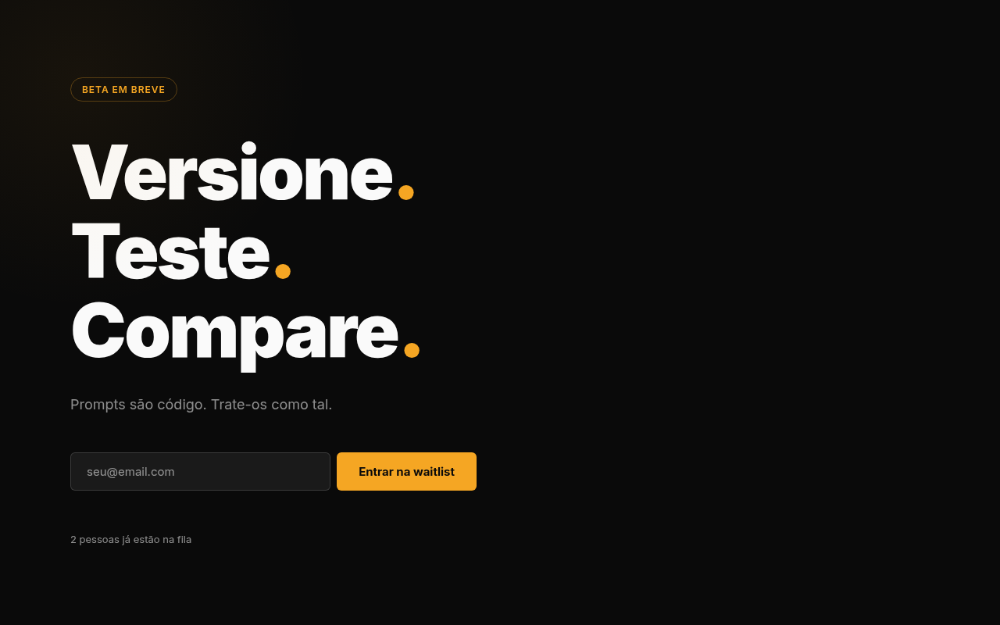
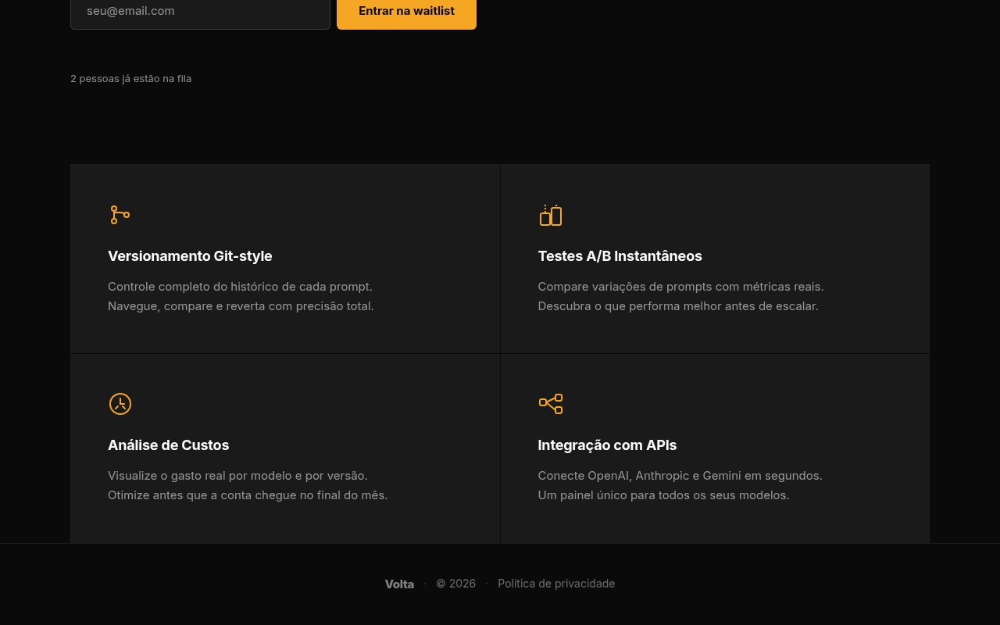

# Volta — Landing Page para Versionamento de Prompts

Volta é uma landing page de captura de leads para uma ferramenta de versionamento, teste e comparação de prompts. O projeto conta com um backend mínimo em Node.js e Express, banco de dados SQLite e frontend em HTML, CSS e JavaScript vanilla.

---

## Funcionalidades Principais

- Cadastro de emails na waitlist com rastreamento de origem
- Registro de interesse por funcionalidade específica
- Contador público de inscritos na waitlist
- Interface responsiva com seção de apresentação e seção de funcionalidades
- Backend RESTful com persistência local em SQLite
- Sem dependências de serviços externos

---

## Screenshots

### Tela Inicial



### Seção de Funcionalidades



---

## Instalação

### Pré-requisitos

- Node.js v18 ou superior
- npm v9 ou superior

### Passos

1. Clone o repositório:

```bash
git clone https://github.com/NatanVP/volta-landing-page-para-ferram.git
cd volta-landing-page-para-ferram
```

2. Instale as dependências:

```bash
npm install
```

3. Inicie o servidor:

```bash
npm start
```

4. Acesse no navegador:

```
http://localhost:3000
```

O banco de dados SQLite é criado automaticamente na primeira execução.

---

## Como Usar

### Acessar a landing page

Abra o navegador e acesse `http://localhost:3000`. Preencha o formulário com seu email para entrar na waitlist.

### Registrar email na waitlist via curl

```bash
curl -s -X POST http://localhost:3000/api/waitlist \
  -H "Content-Type: application/json" \
  -d '{"email": "contato@exemplo.com", "source": "landing-page"}'
```

Resposta esperada:

```json
{
  "success": true,
  "message": "Email registrado com sucesso"
}
```

### Registrar interesse em uma funcionalidade

```bash
curl -s -X POST http://localhost:3000/api/waitlist/interesse \
  -H "Content-Type: application/json" \
  -d '{"email": "contato@exemplo.com", "feature_slug": "comparacao-de-versoes"}'
```

Resposta esperada:

```json
{
  "success": true,
  "message": "Interesse registrado"
}
```

### Consultar total de inscritos

```bash
curl -s http://localhost:3000/api/waitlist/total
```

Resposta esperada:

```json
{
  "total": 42
}
```

---

## Referência da API

| Method | Endpoint                   | Descrição                                      | Body                                      |
|--------|----------------------------|------------------------------------------------|-------------------------------------------|
| POST   | /api/waitlist              | Registra um email na waitlist                  | `{ "email": string, "source"?: string }`  |
| POST   | /api/waitlist/interesse    | Registra interesse em uma funcionalidade       | `{ "email": string, "feature_slug": string }` |
| GET    | /api/waitlist/total        | Retorna o total de emails cadastrados          | —                                         |

### Detalhes dos campos

**POST /api/waitlist**
- `email` (obrigatório): endereço de email do interessado
- `source` (opcional): origem do cadastro, ex: `"landing-page"`, `"compartilhamento"`, `"anuncio"`

**POST /api/waitlist/interesse**
- `email` (obrigatório): endereço de email do interessado
- `feature_slug` (obrigatório): identificador da funcionalidade de interesse, ex: `"versionamento"`, `"comparacao-de-versoes"`, `"historico-de-testes"`

---

## Tecnologias Utilizadas

| Tecnologia         | Versão   | Uso                                      |
|--------------------|----------|------------------------------------------|
| Node.js            | v18+     | Ambiente de execução do servidor         |
| Express            | ^4.x     | Framework HTTP para as rotas da API      |
| SQLite3            | ^5.x     | Banco de dados local para persistência   |
| HTML5              | —        | Estrutura da landing page                |
| CSS3               | —        | Estilização e layout responsivo          |
| JavaScript Vanilla | ES2020+  | Interatividade e consumo da API          |

---

## Estrutura do Projeto

```
volta-landing-page-para-ferram/
├── server.js           # Servidor Express e configuração principal
├── database.js         # Inicialização e schema do banco SQLite
├── package.json        # Dependências e scripts
├── routes/
│   └── waitlist.js     # Rotas da API de waitlist
├── public/
│   ├── index.html      # Landing page
│   ├── style.css       # Estilos
│   └── app.js          # JavaScript do frontend
└── screenshots/
    ├── hero_inicial.png
    └── secao_features.png
```

---

## Licença

MIT
